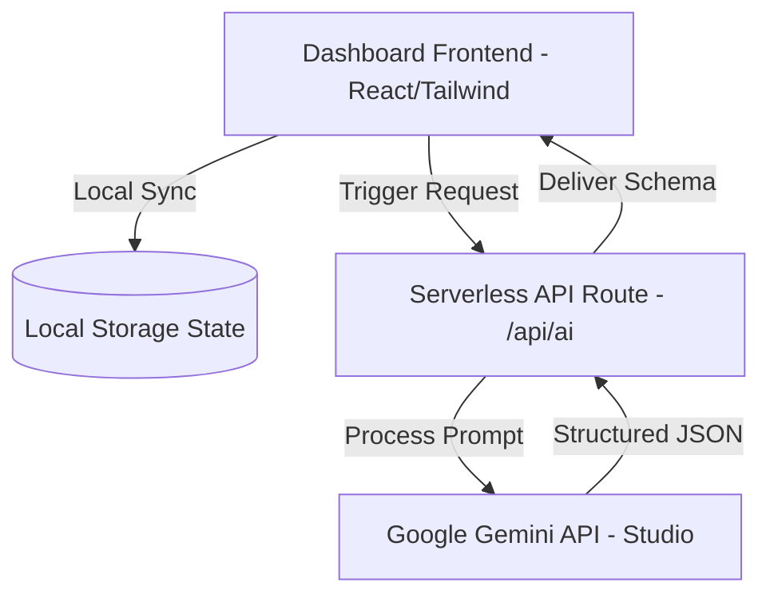

# LifePilot AI — Your Autonomous Life Operations System

> **Submission Track**: Agents for Good  
> **Event**: Kaggle's AI Agents Intensive Vibe Coding Capstone  

---

## 🌟 Overview

**LifePilot AI** is a production-ready, highly interactive personal operations dashboard that leverages autonomous AI agents to solve productivity, learning, and wellness challenges. Rather than acting as a generic conversational chatbot, LifePilot is built as a task-driven engine that breaks down large goals, researches complex topics, generates professional communications, structures decision criteria, tracks hydration/sleep habits, and dynamically scales down UI complexity when stress metrics spike (**Emergency Mode**).

### Key Features
1. **Landing Page**: Modern premium dark-themed hero showcase with glassmorphism layout, animated feature cards, and direct console access.
2. **Dashboard Console**: Master panel summarizing daily tasks, milestone goals, activity metrics, and live AI suggestions.
3. **AI Planner Agent**: Translates multi-day goals into prioritized tasks and lists weekly calendar slot blocks.
4. **Research Roadmap Agent**: Generates structured, phased milestones, summaries, and recommended study resources.
5. **Reminder Agent**: Alerts for birthdays, medicine intake, interviews, bills, and deadlines.
6. **Goal Tracker**: Separated by Daily, Weekly, and Monthly focus increments with checking state synchronization.
7. **Smart Notes**: Synthesis notepad that summarizes concepts and extracts action items to insert directly into your task board.
8. **Email Generator**: Structured tone-aligned email composer (Leave requests, internship queries, follow-ups).
9. **Decision Assistant**: Multi-factor comparative pros/cons grid with risk metrics and AI confidence rating.
10. **Wellness Balance Coach**: Wrist stretch guidelines, hydration trackers, and break prompts to avoid burnout.
11. **Emergency Mode**: One-click cognitive load buster that archives secondary tasks to render a simplified task checklist.

---

## 🏗️ Architecture



- **State Persistence**: 100% of user data (goals, tasks, reminders, wellness, configuration) synchronizes in real-time with browser `localStorage`.
- **API Call Model**: Standardized Next.js serverless route (`/api/ai`) using Google's `@google/generative-ai` SDK.
- **Smart Fallback Engine**: If no `GEMINI_API_KEY` is provided, LifePilot AI automatically falls back to an integrated high-fidelity response parser. The application remains fully interactive and demo-ready immediately.

---

## 🚀 Getting Started

### Prerequisites
- Node.js (v18.0.0 or higher)
- npm or pnpm

### Installation

1. Clone the repository and navigate to the folder:
   ```bash
   git clone <repository_url>
   cd Kaggle
   ```

2. Install dependencies:
   ```bash
   npm install
   ```

3. Run the development server:
   ```bash
   npm run dev
   ```
   Open [http://localhost:3000](http://localhost:3000) to view the application in your browser.

4. (Optional) Configure Gemini API Key:
   Create a `.env.local` file in the root directory:
   ```env
   GEMINI_API_KEY=your_google_ai_studio_key_here
   ```
