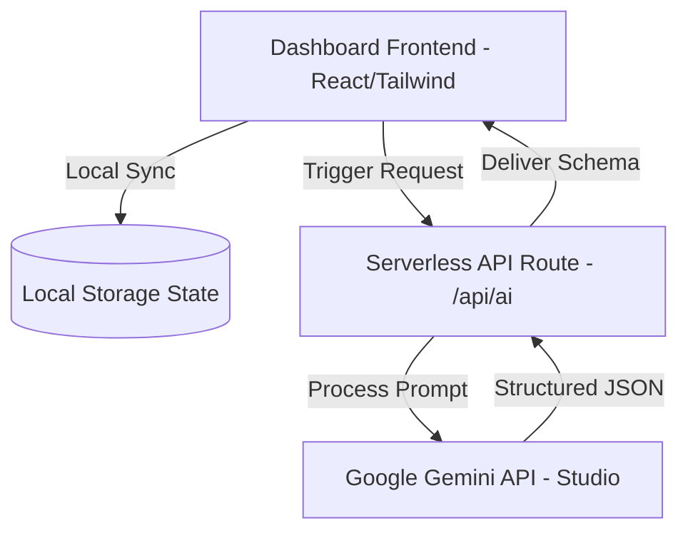

# LifePilot AI — Your Autonomous Life Operations System

> **Submission Track**: Agents for Good  
> **Event**: Kaggle's AI Agents Intensive Vibe Coding Capstone  
> **Deployment Readiness**: 100% Vercel compatible out-of-the-box (Zero-configuration fallback enabled).

---

## 🌟 Overview

**LifePilot AI** is a production-ready, highly interactive personal operations dashboard that leverages autonomous AI agents to solve productivity, learning, and wellness challenges. Rather than acting as a generic conversational chatbot, LifePilot is built as a task-driven engine that breaks down large goals, researches complex topics, generates professional communications, structures decision criteria, tracks hydration/sleep habits, and dynamically scales down UI complexity when stress metrics spike (**Emergency Mode**).

### Key Features
1. **Landing Page**: Modern premium dark-themed hero showcase with glassmorphism layout, animated feature cards, and direct console access.
2. **Dashboard Console**: Master panel summarizing daily tasks, milestone goals, activity metrics, and live AI suggestions.
3. **AI Planner Agent**: Translates multi-day goals into prioritized tasks and lists weekly calendar slot blocks.
4. **Research Roadmap Agent**: Generates structured, phased milestones, summaries, and recommended study resources.
5. **Reminder Agent**: Alerts for birthdays, medicine intake, interviews, bills, and deadlines.
6. **Goal Tracker**: Separated by Daily, Weekly, and Monthly focus increments with checking state synchronization.
7. **Smart Notes**: Synthesis notepad that summarizes concepts and extracts action items to insert directly into your task board.
8. **Email Generator**: Structured tone-aligned email composer (Leave requests, internship queries, follow-ups).
9. **Decision Assistant**: Multi-factor comparative pros/cons grid with risk metrics and AI confidence rating.
10. **Wellness Balance Coach**: Wrist stretch guidelines, hydration trackers, and break prompts to avoid burnout.
11. **Emergency Mode**: One-click cognitive load buster that archives secondary tasks to render a simplified task checklist.

---

## 🏗️ Architecture



- **State Persistence**: 100% of user data (goals, tasks, reminders, wellness, configuration) synchronizes in real-time with browser `localStorage`.
- **API Call Model**: Standardized Next.js serverless route (`/api/ai`) using Google's `@google/generative-ai` SDK.
- **Smart Fallback Engine**: If no `GEMINI_API_KEY` is provided, LifePilot AI automatically falls back to an integrated high-fidelity response parser. The application remains fully interactive and demo-ready immediately.

---

## 🚀 Getting Started

### Prerequisites
- Node.js (v18.0.0 or higher)
- npm or pnpm

### Installation

1. Clone the repository and navigate to the folder:
   ```bash
   git clone <repository_url>
   cd Kaggle
   ```

2. Install dependencies:
   ```bash
   npm install
   ```

3. Run the development server:
   ```bash
   npm run dev
   ```
   Open [http://localhost:3000](http://localhost:3000) to view the application in your browser.

4. (Optional) Configure Gemini API Key:
   Create a `.env.local` file in the root directory:
   ```env
   GEMINI_API_KEY=your_google_ai_studio_key_here
   ```

---

## 🌍 Supabase Integration (Optional Upgrade)

To enable database synchronization instead of client-side `localStorage`, execute the following SQL migration script in your Supabase SQL editor:

```sql
-- Create Tasks Table
CREATE TABLE public.tasks (
    id UUID PRIMARY KEY DEFAULT gen_random_uuid(),
    user_id UUID REFERENCES auth.users(id) ON DELETE CASCADE,
    title TEXT NOT NULL,
    duration TEXT,
    priority TEXT CHECK (priority IN ('high', 'medium', 'low')),
    category TEXT DEFAULT 'Inbox',
    status TEXT CHECK (status IN ('todo', 'done')) DEFAULT 'todo',
    created_at TIMESTAMP WITH TIME ZONE DEFAULT timezone('utc'::text, now())
);

-- Create Goals Table
CREATE TABLE public.goals (
    id UUID PRIMARY KEY DEFAULT gen_random_uuid(),
    user_id UUID REFERENCES auth.users(id) ON DELETE CASCADE,
    title TEXT NOT NULL,
    type TEXT CHECK (type IN ('daily', 'weekly', 'monthly')),
    status TEXT CHECK (status IN ('todo', 'done')) DEFAULT 'todo',
    created_at TIMESTAMP WITH TIME ZONE DEFAULT timezone('utc'::text, now())
);

-- Enable Row Level Security (RLS)
ALTER TABLE public.tasks ENABLE ROW LEVEL SECURITY;
ALTER TABLE public.goals ENABLE ROW LEVEL SECURITY;

-- Create Policies
CREATE POLICY "Users can manage their own tasks" 
ON public.tasks FOR ALL USING (auth.uid() = user_id);

CREATE POLICY "Users can manage their own goals" 
ON public.goals FOR ALL USING (auth.uid() = user_id);
```

---

## ⚡ Vercel Deployment

LifePilot AI is structured to be deployed directly on **Vercel** with one click:

1. Push your repository to GitHub/GitLab.
2. Import the project into the [Vercel Dashboard](https://vercel.com).
3. (Optional) Under **Environment Variables**, add:
   - `GEMINI_API_KEY`: Your key from Google AI Studio.
4. Click **Deploy**. Vercel will build the Next.js production bundle in seconds.
